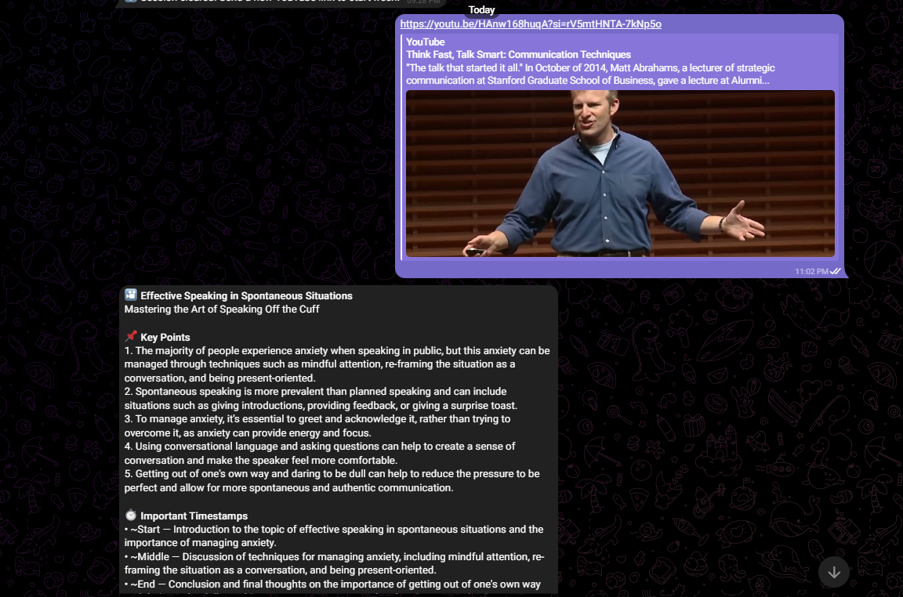
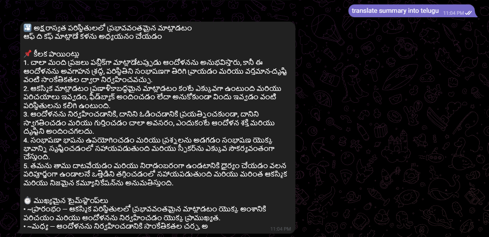

# YouTube Summarizer Telegram Bot

A Telegram bot that acts as an AI research assistant for YouTube videos. Send it a YouTube link and it will fetch the transcript, generate a structured summary, and answer follow-up questions grounded strictly in the video content. Supports English and five Indian languages.

---

## Features

- Structured video summaries with key points, approximate timestamps, and a core takeaway
- Unlimited follow-up Q&A based on the video transcript
- Language support: English, Hindi, Tamil, Telugu, Kannada, Marathi
- Commands: `/summary`, `/deepdive`, `/actionpoints`, `/reset`
- Shared transcript cache across users — the same video is fetched from YouTube only once
- Per-user session isolation with automatic expiry

---
## Screenshots

**1. Video Summarization & Timestamps**


**2. Contextual Q&A**


**3. Multi-Language Support**


---
## Requirements

- Python 3.13 or higher
- A Telegram bot token (from [@BotFather](https://t.me/botfather))
- A Groq API key (free tier at [console.groq.com](https://console.groq.com), 14,400 requests/day)

---

## Setup

### 1. Clone the repository

```bash
git clone <your-repo-url>
cd chat_bot
```

### 2. Create and activate a virtual environment (recommended)

```bash
python -m venv venv
source venv/bin/activate        # Linux / macOS
venv\Scripts\activate           # Windows
```

### 3. Install dependencies

```bash
pip install -r requirements.txt
```

### 4. Configure environment variables

```bash
cp .env.example .env
```

Open `.env` and fill in your credentials:

```
TELEGRAM_TOKEN=your_telegram_bot_token_here
GROQ_API_KEY=your_groq_api_key_here
GROQ_MODEL=llama-3.3-70b-versatile
```

`GROQ_MODEL` defaults to `llama-3.3-70b-versatile` and does not need to be changed unless you want to experiment with a different model.

### 5. Run the bot

```bash
python bot.py
```

The bot will start polling for messages. Press `Ctrl+C` to stop.

---

## Project Structure

```
chat_bot/
├── bot.py                    # Entry point: builds the app, registers handlers, starts polling
├── handlers/
│   ├── command_handler.py    # /start /help /summary /deepdive /actionpoints /reset
│   ├── link_handler.py       # YouTube URL detection, transcript fetching, summary generation
│   └── qa_handler.py         # Q&A replies and language switching
├── services/
│   ├── cache.py              # Global transcript cache (LRU + TTL, shared across users)
│   ├── session.py            # Per-user session state (TTL + conversation history)
│   ├── llm.py                # Groq API integration (summarize, translate, Q&A, deepdive)
│   └── transcript.py         # YouTube transcript fetching via youtube-transcript-api
└── utils/
    ├── url_parser.py         # Regex-based YouTube URL and video ID extraction
    └── telegram_helpers.py   # Long message splitting to respect Telegram's 4096-char limit
```

---

## Tech Stack

| Component | Library / Service |
|---|---|
| Telegram bot framework | python-telegram-bot 22.6 |
| LLM inference | Groq API — llama-3.3-70b-versatile |
| Transcript fetching | youtube-transcript-api 1.2.4 |
| Environment config | python-dotenv 1.0.1 |

---

## Architecture

### Message Routing

All incoming text messages pass through `route_message` in `bot.py`. If the message contains a recognizable YouTube URL (detected by `utils/url_parser.py`), it is forwarded to `link_handler`. Otherwise it goes to `qa_handler`. Slash commands are handled separately by `command_handler`.

### Transcript Cache (Global, Shared)

`services/cache.py` maintains a single in-memory `TranscriptCache` instance shared across all users.

The key insight is that transcripts are identified by `video_id`, not by user. If ten different users send the same YouTube link, the transcript is fetched from YouTube exactly once. All subsequent requests are served from the cache.

Configuration:
- TTL: 24 hours. YouTube auto-captions are stable; there is no reason to re-fetch within the same day.
- Capacity: 200 videos maximum. When full, the least-recently-used entry is evicted first. Expired entries are also pruned before eviction to avoid unnecessarily removing valid entries.
- Cached summaries: The English summary generated for a video is also stored in the cache entry. If a second user requests the same video in English, no LLM call is made for summarization — the cached summary is returned directly.

The cache is in-memory only and is cleared on restart. This is acceptable because transcripts are cheap to re-fetch; the cost saving matters at runtime, not across deployments.

### Session Management (Per-User)

`services/session.py` maintains one `UserSession` per Telegram `chat_id`, stored in a module-level dictionary.

Each session holds:
- The currently loaded video ID and full transcript text
- The generated summary
- The user's preferred response language
- Conversation history (last 20 messages)
- A `last_active` timestamp updated on every interaction

Sessions expire after 2 hours of inactivity and are garbage-collected by a periodic cleanup job that runs every 30 minutes (`cleanup_job` in `bot.py`). Cleanup is also triggered passively: `get_session` returns a fresh session if the stored one is expired.

Users never share session state. Two users interacting simultaneously with the same bot maintain fully independent sessions.

### Transcript Handling

`services/transcript.py` wraps `youtube-transcript-api`. It attempts to fetch transcripts in this priority order:

1. English transcript (manual or auto-generated)
2. Any manually created transcript in any language
3. Any auto-generated transcript in any language

The result is a single plain-text string of the full transcript. No chunking is done — the full text is passed to the LLM in one call.

### LLM Integration

`services/llm.py` wraps the Groq API. All calls go through `_ask()`, which implements a simple retry with a 15-second backoff on rate-limit errors (HTTP 429), retrying up to three times before raising.

**Summarization** sends up to 4,500 words of the transcript with a structured prompt that specifies the exact output format (key points, approximate timestamps, core takeaway). The word limit is a practical guard against very long transcripts exceeding token limits, not a design constraint — the model context window is large enough to handle most videos in full.

**Q&A** sends up to 4,000 words of the transcript along with the last 8 messages of conversation history. The system prompt instructs the model to refuse questions not answered by the transcript. This prevents hallucination by design rather than by post-processing.

**Translation** takes an existing English summary and translates it into the target language. This is significantly faster and cheaper than regenerating the summary from the transcript in a different language.

**Language detection** is a simple keyword match on the user's message text. Supported trigger words include both English names ("hindi", "tamil") and native-script equivalents ("हिंदी", "தமிழ்"). This avoids an extra LLM call for a straightforward classification task.

---

## Design Trade-offs

### In-Memory Storage vs. a Database

All state (transcript cache, sessions) lives in process memory. This means everything is lost on restart, and the bot cannot run as multiple instances behind a load balancer.

The trade-off is simplicity and speed. For a single-process bot with moderate traffic, memory is sufficient. Transcripts are cheap to re-fetch. Sessions are transient by nature. A database (Redis, SQLite) would be the right next step if horizontal scaling or persistence across restarts becomes necessary.

### Full Transcript vs. Chunking

The transcript is sent to the LLM in a single call rather than split into chunks and processed separately. Chunking approaches (e.g., map-reduce summarization) lose cross-chunk context and require multiple LLM calls, which increases latency and API usage.

The trade-off is that very long transcripts may approach or exceed token limits. The current word-count cap (4,000–4,500 words) is a safety margin, not a hard architectural limit. For the target use case (typical YouTube videos under 60–90 minutes), this is not a problem in practice.

### Groq / llama-3.3-70b vs. Other Providers

Groq was chosen because it offers a generous free tier (14,400 requests/day), fast inference, and an OpenAI-compatible API. The llama-3.3-70b-versatile model provides good quality for summarization and Q&A tasks.

The trade-off is that Groq's free tier has rate limits (30 requests/minute) that may cause delays under simultaneous heavy usage. The retry logic in `_ask()` handles transient rate-limit errors, but sustained high traffic would require either a paid plan or batching requests.

### Conversation History Cap

Conversation history is capped at 20 messages per session. This bounds the token cost of every Q&A call: each request includes at most 8 messages of history (the last 4 exchanges), keeping prompt size predictable regardless of how long a conversation runs.

The trade-off is that the model loses context from earlier in the conversation after the cap. For typical video Q&A sessions, 10 exchanges is more than sufficient. Deep research sessions that require very long context would need a larger limit or a retrieval-based approach.

### Translation Reuses Cached Summary

When a user requests a language switch, the bot translates the existing English summary rather than re-running summarization from the transcript in the target language.

The trade-off is a minor quality reduction: the translation is one step removed from the source material, and any nuance lost in the English summary is not recovered. In practice, the quality difference is negligible for the supported languages, and the latency and cost savings are significant.

---

## Environment Variables

| Variable | Description | Default |
|---|---|---|
| `TELEGRAM_TOKEN` | Telegram bot token from @BotFather | Required |
| `GROQ_API_KEY` | Groq API key from console.groq.com | Required |
| `GROQ_MODEL` | Groq model identifier | `llama-3.3-70b-versatile` |

---

## Commands Reference

| Command | Description |
|---|---|
| `/start` | Introduction and usage guide |
| `/help` | Same as /start |
| `/summary` | Re-display the summary for the currently loaded video |
| `/deepdive` | Detailed analytical breakdown of themes and arguments |
| `/actionpoints` | Numbered list of actionable recommendations from the video |
| `/reset` | Clear current session and start fresh |
